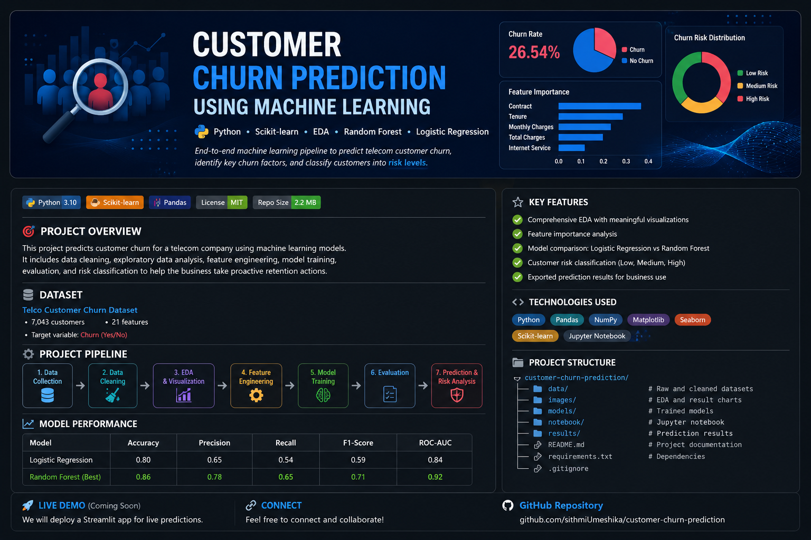
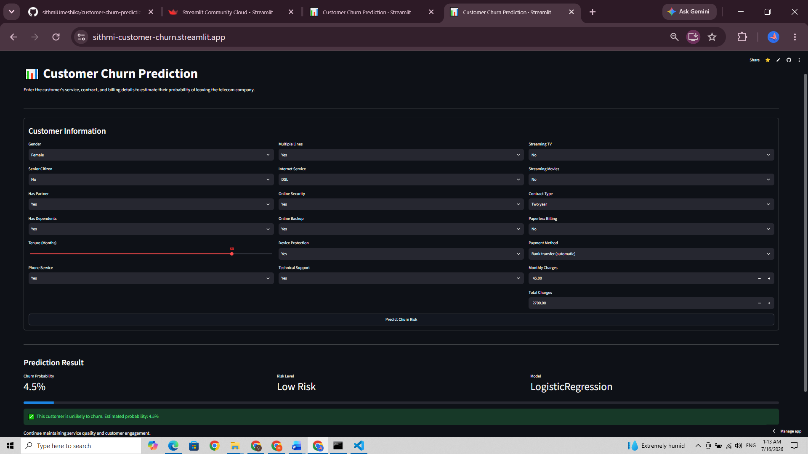
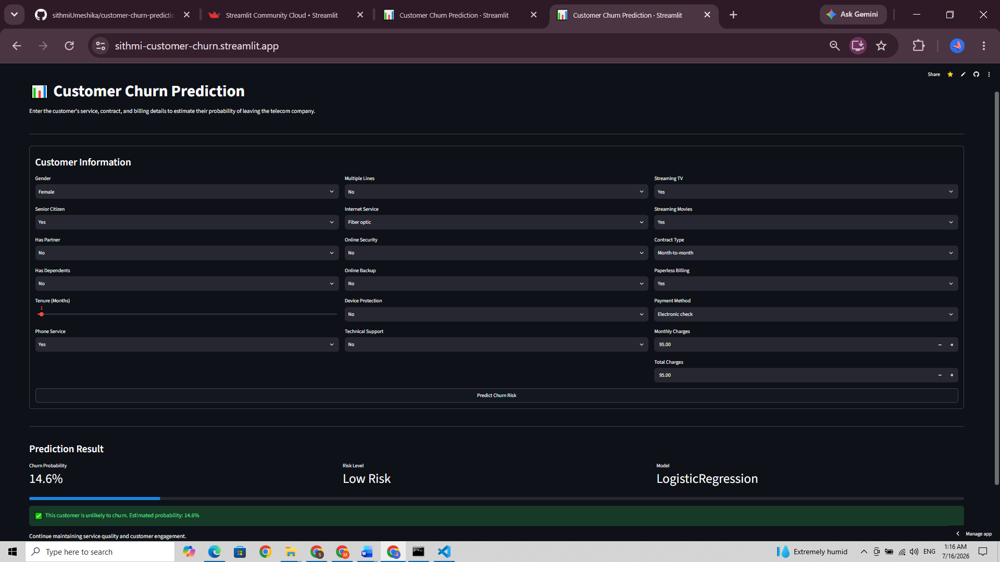

[](https://sithmi-customer-churn.streamlit.app)
# Customer Churn Prediction Using Machine Learning


## Project Overview

Customer churn occurs when an existing customer stops using a company's products or services. Predicting churn allows companies to identify customers who are likely to leave and take suitable retention actions.

This project develops an end-to-end machine learning solution to predict customer churn in a telecommunications company. It includes data cleaning, exploratory data analysis, feature engineering, model development, performance evaluation, customer risk classification, and business recommendations.

---

## Business Problem

Customer acquisition is often more expensive than customer retention. Therefore, telecom companies need an effective way to identify customers who are at risk of leaving.

The main objective of this project is to answer the following question:

> Can machine learning identify customers who are likely to churn using their service, contract, billing, and account information?

---

## Project Objectives

- Understand and clean the telecom customer dataset
- Identify customer churn patterns through exploratory data analysis
- Transform categorical data into machine-readable features
- Develop Logistic Regression and Random Forest models
- Evaluate models using multiple classification metrics
- Identify the most important churn-related features
- Classify customers into low, medium, and high-risk groups
- Provide practical customer-retention recommendations

---

## Dataset

The project uses the IBM Telco Customer Churn dataset.

The dataset originally contained:

- **7,043 customer records**
- **21 columns**
- Customer demographic information
- Subscribed service information
- Contract and payment details
- Monthly and total charges
- Customer churn status

After data cleaning, the final dataset contained **7,032 records**.

### Target Variable

- `0` – Customer remained with the company
- `1` – Customer churned

---

## Technologies Used

- Python
- Pandas
- NumPy
- Matplotlib
- Seaborn
- Scikit-learn
- Joblib
- Google Colab
- GitHub

---

## Project Workflow

```text
Business Understanding
        ↓
Data Collection
        ↓
Data Exploration
        ↓
Data Cleaning
        ↓
Exploratory Data Analysis
        ↓
Feature Engineering
        ↓
Train-Test Split
        ↓
Model Development
        ↓
Model Evaluation
        ↓
Feature Importance
        ↓
Customer Risk Classification
        ↓
Business Recommendations
## 🌐 Streamlit Web Application

A Streamlit web application was developed to provide real-time customer churn predictions.
The application is deployed on Streamlit Community Cloud and is available through the live demo link above.

### Features

- Predict customer churn probability
- Display customer risk level
- Show prediction confidence
- Business recommendations based on prediction
- Interactive and user-friendly interface

### Run the Application

```bash
streamlit run app.py
```

The application will open in your browser at:

```
http://localhost:8501
```
## 📸 Application Screenshots

### Customer Input Form



### Low-Risk Prediction


### High-Risk Prediction



---
## 🧠 Machine Learning Workflow

```mermaid
flowchart LR
    A[Raw Telco Dataset] --> B[Data Cleaning]
    B --> C[Exploratory Data Analysis]
    C --> D[Feature Engineering]
    D --> E[Train-Test Split]
    E --> F[Logistic Regression]
    E --> G[Random Forest]
    F --> H[Model Evaluation]
    G --> H
    H --> I[Best Model Selection]
    I --> J[Churn Probability]
    J --> K[Risk Classification]
    K --> L[Streamlit Web Application]
